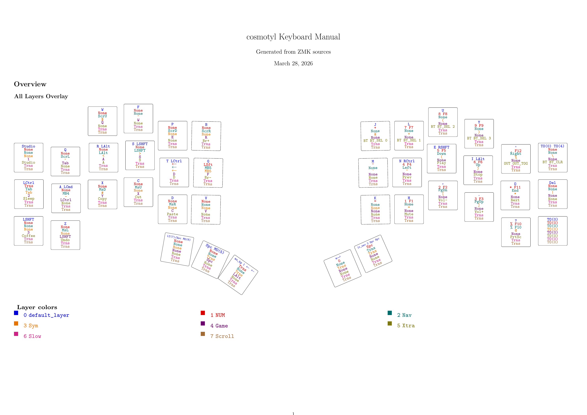
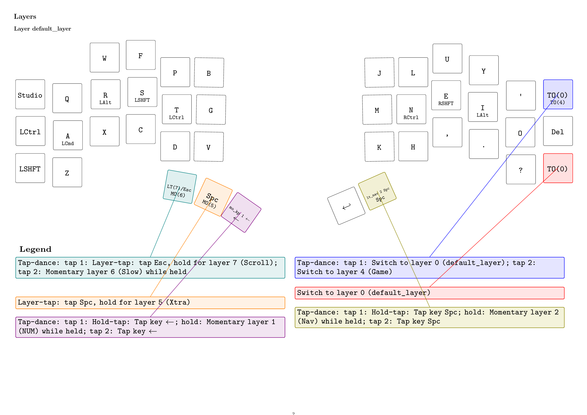

# zmkmanual

LuaLaTeX-first toolkit for generating physical-layout ZMK manuals from source-of-truth keymaps.

## Scoping Plan

1. Core reliability
   - Harden parser coverage for real-world behavior patterns.
   - Tighten strict-mode error paths and diagnostics.
   - Keep deterministic output ordering for stable docs diffs.
2. Authoring ergonomics
   - Improve label/alias normalization and symbol rendering.
   - Expand script ergonomics for keyboard naming and output targeting.
   - Keep empty-state behavior explicit for combos/macros.
3. Documentation + publishing
   - Add reproducible image export workflow for README/docs embedding.
   - Provide opinionated examples and copy-paste command recipes.
   - Add a concise maintenance checklist for future contributors.

Unresolved questions:

- Keep docs minimal utilitarian, or add branded style variant?
- Export only PNG from script, or add SVG/JPG modes?
- Keep one-page-per-image always, or add selected-page flag?

## Repository Layout

- `zmkmanual.sty`: package surface and TeX commands
- `zmkmanual.lua`: loader + orchestration + TeX-facing render commands
- `parser.lua`: ZMK/devicetree parsing + semantic resolution
- `renderer.lua`: TikZ geometry + key rendering
- `labels.lua`: key labels, aliases, symbol normalization
- `annotations.lua`: complex-binding callouts and legend connectors
- `build-manual.py`: one-shot PDF (and optional image) build helper

## LaTeX Commands

- `\zmkLoadConfig`
- `\zmkPrintLayerOverview`
- `\zmkPrintAllLayers`
- `\zmkPrintLegend`
- `\zmkPrintCombos`
- `\zmkPrintMacros`

## Quick Start

Requirements:

- `lualatex` (TeX Live with LuaHBTeX)
- optional for docs images: `pdftoppm` (Poppler)

Build from any local ZMK repo:

```bash
./build-manual.py /path/to/local/zmk-config
```

Default output:

- `./<keyboard>-manual.pdf` (current working directory)

Useful flags:

```bash
./build-manual.py /path/to/local/zmk-config \
  --shield cosmotyl \
  --keyboard cosmotyl \
  --output ./artifacts/
```

- `--keyboard <name>` sets package `keyboard=` and output basename.
- `--output <path>` supports file path or directory path.

## Image Export for Documentation

The script can export per-page PNGs from the generated PDF.

```bash
./build-manual.py /path/to/local/zmk-config \
  --keyboard cosmotyl \
  --images-dir ./docs/images/cosmotyl \
  --image-dpi 180
```

Output naming pattern:

- `docs/images/cosmotyl/cosmotyl-manual-page-01.png`
- `docs/images/cosmotyl/cosmotyl-manual-page-02.png`
- ...

Example images:




## Notes

- LuaLaTeX-only package.
- Style intentionally utilitarian.
- Combos/macros sections show explicit empty-state text when absent.
- For dense layouts, prefer larger page formats (e.g. `a3paper,landscape`).
