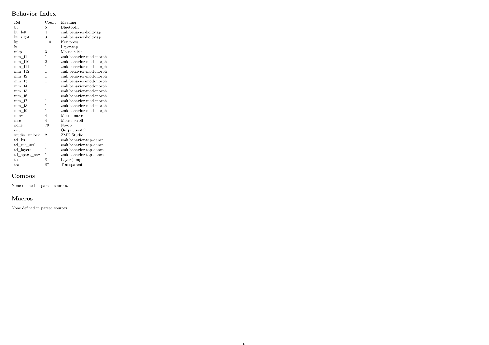

# zmk-manual-gen

LuaLaTeX toolkit for generating physical-layout ZMK manuals from source-of-truth keymaps.

## Repository Layout

- `zmkmanual.sty`: package surface and TeX commands
- `zmkmanual.lua`: loader + orchestration + TeX-facing render commands
- `parser.lua`: ZMK/devicetree parsing + semantic resolution
- `renderer.lua`: TikZ geometry + key rendering
- `labels.lua`: key labels, aliases, symbol normalization
- `annotations.lua`: complex-binding callouts and legend connectors
- `build-manual.py`: one-shot PDF (and optional image) build helper
- `github-workflow-build-zmk-example.yml`: minimal upstream ZMK firmware workflow
- `github-workflow-build-zmk-with-manual-matrix-example.yml`: extension pattern with manual build matrix by shield

## LaTeX Commands

- `\zmkLoadConfig`
- `\zmkPrintLayerOverview`
- `\zmkPrintAllLayers`
- `\zmkPrintLegend`
- `\zmkPrintCombos`
- `\zmkPrintMacros`

## Quick Start

Requirements:

- `lualatex` (TeX Live with LuaHBTeX)
- optional for docs images: `pdftoppm` (Poppler)

Build from any local ZMK repo:

```bash
./build-manual.py /path/to/local/zmk-config
```

Default output:

- `./<keyboard>-manual.pdf` (current working directory)

Useful flags:

```bash
./build-manual.py /path/to/local/zmk-config \
  --shield cosmotyl \
  --keyboard cosmotyl \
  --output ./artifacts/
```

- `--keyboard <name>` sets package `keyboard=` and output basename.
- `--output <path>` supports file path or directory path.

## Image Export for Documentation

The script can export per-page PNGs from the generated PDF.

```bash
./build-manual.py /path/to/local/zmk-config \
  --keyboard cosmotyl \
  --images-dir ./docs/images/cosmotyl \
  --image-dpi 180
```

Output naming pattern:

- `docs/images/cosmotyl/cosmotyl-manual-page-01.png`
- `docs/images/cosmotyl/cosmotyl-manual-page-02.png`
- ...

## GitHub Actions Integration

This repo includes workflow examples for extending the upstream ZMK reusable build workflow.

Minimal base workflow:

- `github-workflow-build-zmk-example.yml`
- Only calls `zmkfirmware/zmk/.github/workflows/build-user-config.yml@v0.3`

Extended workflow with manual generation matrix:

- `github-workflow-build-zmk-with-manual-matrix-example.yml`
- Keeps the same base ZMK build job
- Adds `manual` job with matrix `shield`/`keyboard`
- Builds PDF + PNG pages via `build-manual.py`
- Uploads per-shield artifacts

How to use the extended example:

1. Copy file to your ZMK config repo under `.github/workflows/`.
2. Replace matrix values with your real shields/keyboards.
3. Replace `repository: your-org/zmk-manual-gen` with your tool repo.
4. Optionally pin `ref:` to a release tag or commit SHA.

## PDF Walkthrough

### All-Layers Overview


This first page is an overlay view across all layers. Every physical key position appears once, and each colored line inside a key is that key's behavior on a different layer. The "Layer colors" legend maps each color to its layer.

### Per-Layer Detail Page


After the overview, the PDF switches to individual layer pages. Each key is rendered in exact physical position, and complex behaviors are called out with connector lines to the legend so keycaps stay readable while still documenting hold-tap/tap-dance/layer actions.

### Reference Sections



The final section is reference-oriented: behavior index (ref/count/meaning), then combos and macros. Combos/macros are always shown, including explicit "none defined" output when the source has none.
